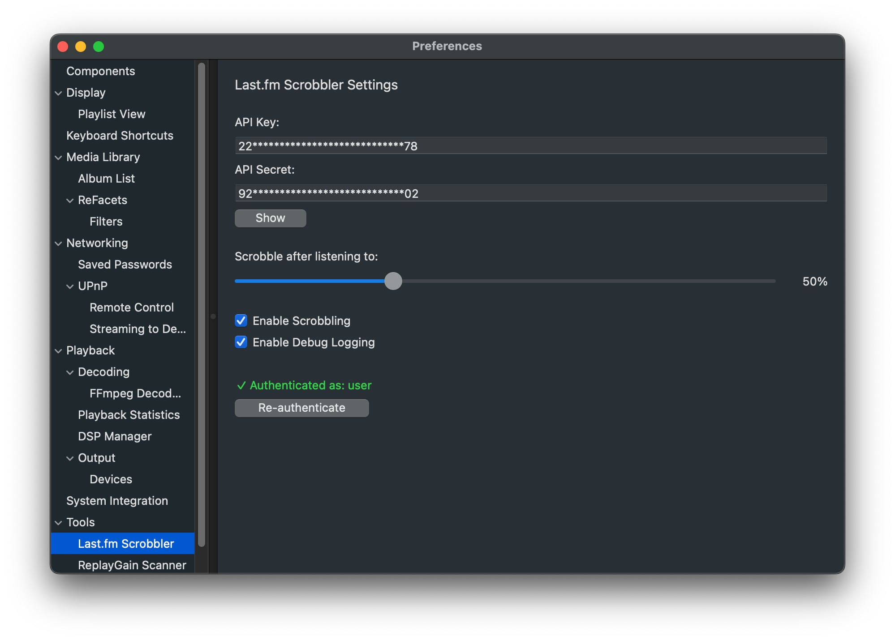
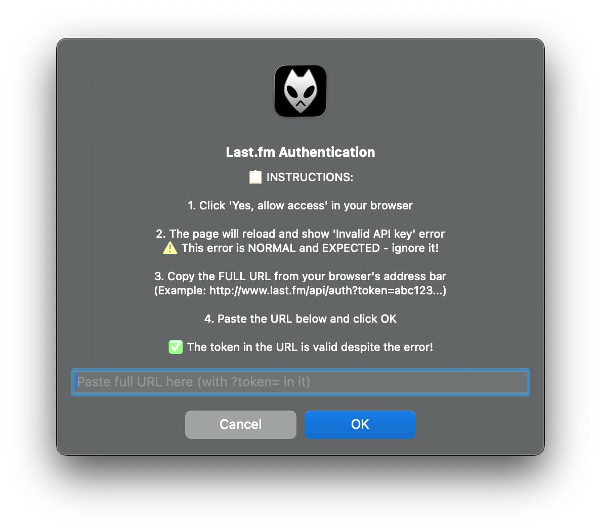
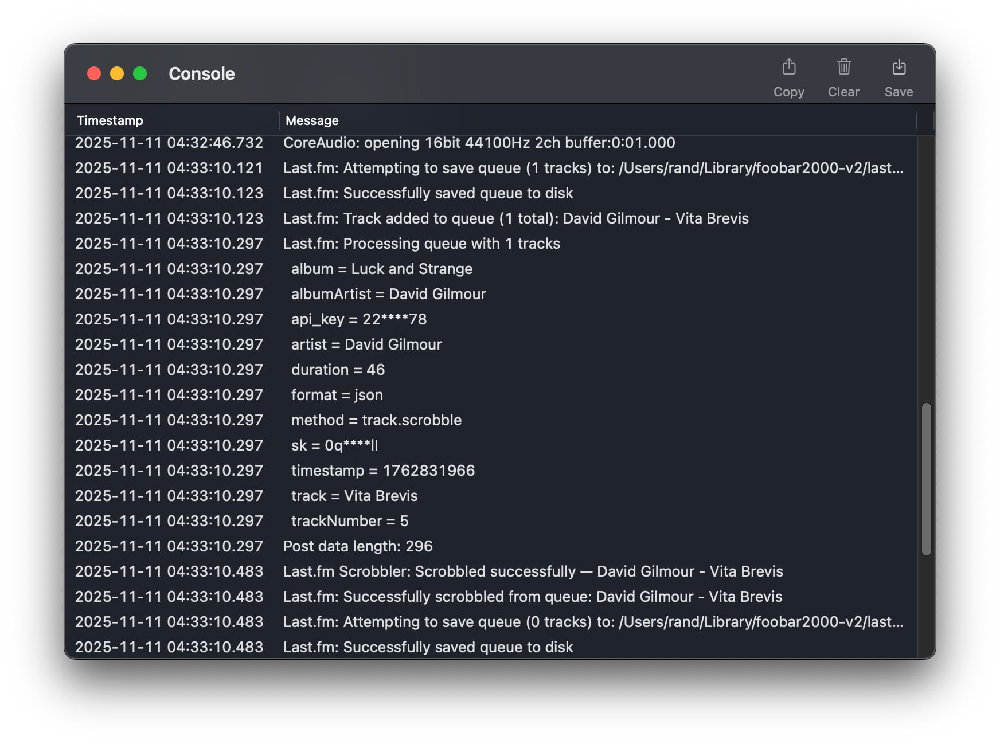

# 🎵 foo_mac_scrobble — Last.fm Scrobbler for foobar2000 macOS

> Native macOS **Last.fm scrobbler plugin** for [foobar2000](https://www.foobar2000.org/mac).  
> Built with the official foobar2000 SDK and Cocoa (Objective-C++), featuring native preferences UI, offline queueing, async networking, and full Last.fm API support.

---

## ✨ Features

- 🎧 Automatically **scrobbles tracks** you play to Last.fm
- 🔄 **Offline queueing:** saves plays when offline and submits later
- 🔐 Secure **authentication** with your own Last.fm API key
- ⚙️ Native **macOS Preferences UI** for setup and debugging
- 📊 Adjustable **scrobble threshold** (percent of track listened)
- 🧰 Integrated **debug logging** visible in foobar2000 console
- 🚀 Fully asynchronous and non-blocking network I/O (libcurl)
- 🪶 Lightweight, native, and open source

---

## 📦 Installation

### Option 1 — Install the Release (Recommended)

1. Download the latest release ZIP from [👉 Releases](../../releases)
2. Unzip it — it will contain:
   ```
   foo_mac_scrobble.component/
   ```
3. Copy the folder into your foobar2000 user components directory:
   ```
   ~/Library/foobar2000-v2/user-components/foo_mac_scrobble/
   ```
4. Restart foobar2000  
   → the plugin will load automatically

---

## 🧰 Configuration

Open **Preferences → Tools → Last.fm Scrobbler**

### 1. Enter your API credentials

- Get them from [https://www.last.fm/api/account/create](https://www.last.fm/api/account/create)
- Paste your **API Key** and **API Secret**

### 2. Authenticate

- Click **Authenticate**
- A browser window opens → approve access on Last.fm
- After "Invalid API key" appears (expected), copy the full URL
- Paste the full URL back into the dialog and press OK
- You should see a ✅ *Authenticated as: yourusername* message

### 3. Adjust preferences

- Set "Scrobble after listening to" percentage
- Toggle "Enable Debug Logging" as needed

> 💡 **Tip:** Debug messages are shown in foobar2000's Console.

---

## 📸 Screenshots

**Preferences UI**

<p align="left">
  
</p>

**Authentication Flow**

<p align="left">
  
</p>

**Debug Console**

<p align="left">
  
</p>

---

## 🧠 How It Works

- The plugin monitors foobar2000 playback events
- When a track passes your configured threshold (e.g. 50%), it's scrobbled
- If offline, tracks are stored in a local JSON queue:
  ```
  ~/Library/foobar2000-v2/lastfm_scrobble_queue.json
  ```
- Once network connectivity returns, the queue is retried automatically
- Authentication info is persisted in `lastfm_session.json`

---

## ⚙️ Building

You can build the component either via the **Xcode GUI** or the **CLI** (as in CI workflow).

### 🧩 Prerequisites

- **macOS 12+**
- **Xcode 15+**
- **Homebrew**
- foobar2000 SDK (included in this repo)
- **libcurl** installed from Homebrew:

```bash
brew install curl
```

The project expects `libcurl.4.dylib` at:
```
/opt/homebrew/opt/curl/lib/libcurl.4.dylib
```

### 🧱 Build via Xcode (GUI)

1. Open the project:
   ```bash
   foobar2000/foo_mac_scrobble/foo_mac_scrobble.xcodeproj
   ```

2. Select the `foo_mac_scrobble` scheme

3. Ensure **Build Configuration: Release**

4. Press **⌘B** (or choose **Product → Build**)

That's it — all paths and settings are preconfigured.

On success, you'll find the compiled component in:
```
~/Library/foobar2000-v2/user-components/foo_mac_scrobble/foo_mac_scrobble.component/
```

### 🧱 Build via CLI (same as GitHub Actions)

You can replicate the exact workflow used in CI:

```bash
cd foobar2000/foo_mac_scrobble
xcodebuild -project foo_mac_scrobble.xcodeproj \
  -scheme foo_mac_scrobble \
  -configuration Release \
  -derivedDataPath build \
  OTHER_CPLUSPLUSFLAGS="-DFOO_LASTFM_DEBUG_DEFAULT=1 \
  -DFOO_LASTFM_CI_API_KEY='\"<YOUR_API_KEY>\"' \
  -DFOO_LASTFM_CI_API_SECRET='\"<YOUR_API_SECRET>\"'"
```

After a successful build, copy the resulting directory:

```bash
find build -name "foo_mac_scrobble.component" -exec cp -r {} \
  ~/Library/foobar2000-v2/user-components/foo_mac_scrobble/ \;
```

### 🧪 CI / GitHub Actions

The repository includes a full workflow (`.github/workflows/build.yml`) that:

- Builds the plugin via Xcode on `macos-latest`
- Downloads foobar2000
- Installs the built component
- Runs a self-test verifying Last.fm API initialization and queue processing
- Uploads build logs as artifacts

See [workflow source](.github/workflows/build.yml) for details.

---

## 🧩 Repository Structure

```
.
├── foobar2000/
│   └── foo_mac_scrobble/           # Main plugin source
│       ├── Mac/                    # Cocoa UI code
│       ├── *.cpp / *.h             # Core logic
│       ├── foo_mac_scrobble.xcodeproj
│       └── thirdparty/
├── libPPUI/                        # Foobar UI library
├── pfc/                            # Core support library
├── LICENSE
├── sdk-license.txt
└── sdk-readme.html
```

---

## 🧠 Technical Overview

| Module | Description |
|--------|-------------|
| `lastfm_api.*` | Handles Last.fm API calls, auth, and signatures |
| `session_manager.*` | Stores and loads Last.fm session key |
| `scrobble_queue.*` | Manages offline queue and retry logic |
| `play_callback.cpp` | Hooks into foobar playback events |
| `fooLastfmMacPreferences.*` | Native macOS preferences UI |
| `initquit.cpp` | Plugin lifecycle and background worker |
| `config.*` | Foobar config GUIDs and variables |

---

## 🧹 Clearing Cache / Troubleshooting

If scrobbling stops or re-auth fails, you can safely delete:

```
~/Library/foobar2000-v2/lastfm_session.json
~/Library/foobar2000-v2/lastfm_scrobble_queue.json
```

Then restart foobar2000 and re-authenticate.

Enable **Debug Logging** in Preferences to see detailed console output:

```
Last.fm: Queue initialized, 10 tracks loaded
Last.fm: Successfully scrobbled from queue
Last.fm: Successfully saved queue to disk
```

---

## ⚖️ License

**MIT License** © Oleksandr Velychko

See [LICENSE](LICENSE) for details.

---

> 🧠 Developed in a vibe-coding workflow — collaboratively between human insight and LLM assistance.  
> The result: a stable, native macOS foobar2000 component that balances rapid prototyping with real engineering discipline.

---

## 💬 Credits

- [foobar2000 SDK](https://www.foobar2000.org/SDK)
- [Last.fm API](https://www.last.fm/api)
- Built and tested with ❤️ on macOS

**If you enjoy this plugin — star the repo or share feedback on foobar2000 forums!**
